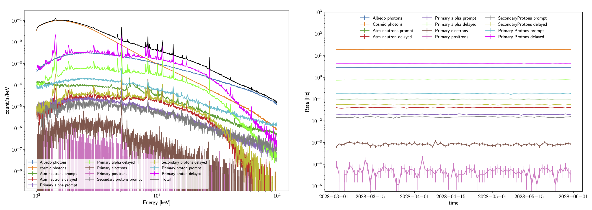
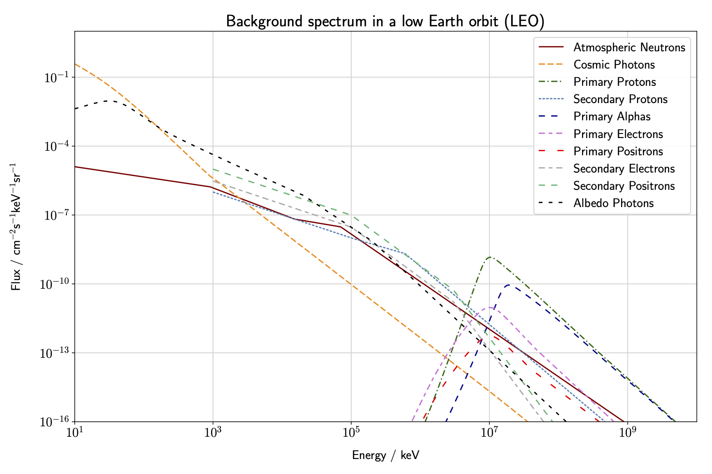
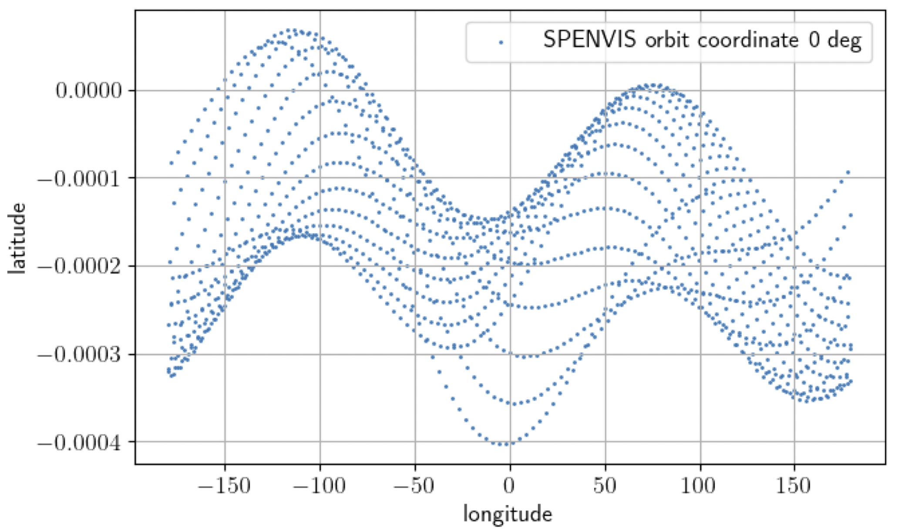
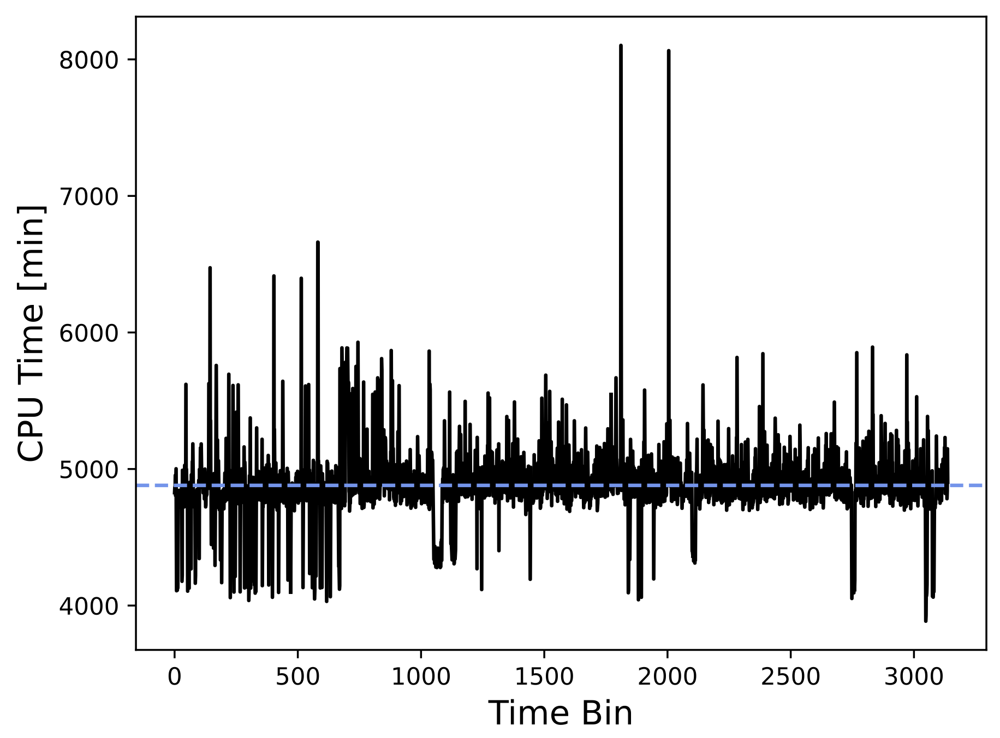
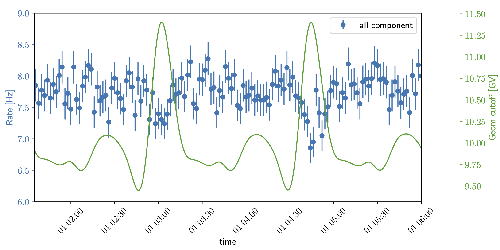
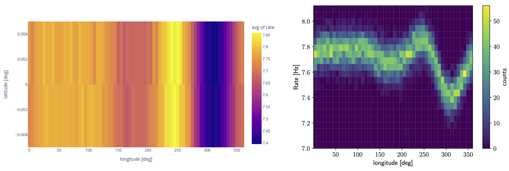
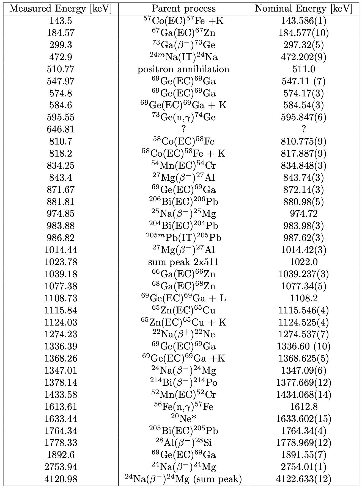

# Backgrounds

### Executive Summary
We employed MEGAlib to simululate 3 months of instrumental and astrophysical backgrounds (BGs), using an equatorial orbit at 550 km with a zenith pointing. The astrophysical BGs include albedo emission and cosmic photons (i.e. the extragalactic gamma-ray background). The instrumental backgrounds arise from cosmic rays bombarding the instrument, and there is both a prompt component and a delayed component. The former is due to cosmic ray particles directly triggering the instrument. The latter is due to activation of the irradiated materials, which subsequently decay and emit photons that contribute to the BG emission. The insturmental BGs arise mainly from primary protons, primary alpha particles, atmospheric neutrons, primary electrons, primary positrons, and secondary protons, all of which are included in DC2. Our background simulations account for the time-dependent flux variation due to the changing geomagnetic cutoff along the orbit. Another important BG for COSI will be due to passage through the Southern Atlantic Anomoly (SAA). The SAA component is not included in DC2, but it will be included starting with DC3. Additionally, it will also be important to account for the long-term buildup of the activation emission. This too is not included in DC2, but will be included starting with DC3. Spectra and lightcurves for the DC2 BG components are shown below. Further details about the BG simulations are provided in the sections that follow. 

## Input Models

### Spectra and Source Files 
The input spectra are generated using the model from [Cumani](https://link.springer.com/article/10.1007/s10686-019-09624-0). This is implemented using the code **generate\_bcksource.py**, available in the **sg\_update** branch of the [cosi-background](https://github.com/cositools/cosi-background/tree/sg_update) repository. The source files used by cosima are also generated by this code. The user can choose the main parameters, including altitude, inclination, geomagnetic cutoff, etc. For DC2 we simulated an equatorial orbit at 550 km with a zenith pointing. Correspondingly, for the BGs we used the average rigidity cutoff for this orbit (10 GV) as the nominal value. Solar modulation is accounted for using the force field approximation, for which we use 650 MV, representative of the average solar activity. The resulting spectra are shown below. All of the input files used for the DC2 simulations can be found [here](https://github.com/cositools/cosi-data-challenges/tree/main/cosi_dc/Source_Library/DC2/backgrounds). 

### Geomagnetic Cutoff Dependencies
The spacecraft coordinates have been generated with [SPENVIS](https://www.spenvis.oma.be/intro.php), as shown below. 

Based on these coordinates, the average geomagnetic cutoff (in GV) is calculated as in [Smart and Shea (2005)](https://www.sciencedirect.com/science/article/pii/S0273117705001997?via%3Dihub):

$$ R_{\mathrm{cutoff}} = \frac{g^1_0\cdot R_{\mathrm{Earth}}}{4}\cdot \left( 1+\frac{h}{R_{\mathrm{Earth}}}\right)^{-2}\cos^4({\lambda}), $$

with $h$ the altitude in km, $R_{\mathrm{Earth}}$ the radius of Earth, $\lambda$ the geomagnetic latitude, and $g^1_0$ a coefficient computed by the International Geomagnetic Reference Field [IGRF](https://www.ncei.noaa.gov/products/international-geomagnetic-reference-field). The geomagnetic latitude for each orbit is computed with the python package [aacgmv2](https://pypi.org/project/aacgmv2/). The IGRF results are released every 5 years. For the DC2 simulations we used the value from the years 2020-2025: $g^1_0 =29404.8$ nT. Note that this values is known to be decreasing with time, and the planned launch date for COSI is 2027. Although the corresponding change will be minimal, we plan to still update the geomagnetic cutoff distribution for future simulations.       

We calculate the geomagnetic cutoff for 15 second time intervals of the 3 month orientation file, and use this to obtain the integrated spectrum for each BG component. The geomagnetic cutoff dependencies are described in [Cumani+19](https://link.springer.com/article/10.1007/s10686-019-09624-0). This results in a light curve for each component, which is used as input for the simulation, in order to take into account the geomagnetic cutoff dependencies in the expected BG flux. Note that cosima only takes the light curve shape into account, and the overall flux normalization is set by the spectrum. We make the simplifying approximation that the spectral shape is constant with time. This is a reasonable assumption, considering that the geomagnetic cutoff only varies from 9-11.5 GV, and correspondingly, the change in spectral shape is minor.

## Simulations

The BG simulations have been ran on the [MOGON](https://mogonwiki.zdv.uni-mainz.de/docs/introduction/what_is_mogon) cluster in Mainz and Clemson University's [Palmetto](https://docs.rcd.clemson.edu/palmetto/) cluster. They employ [MEGAlib](https://github.com/zoglauer/megalib) (*main* and *feature/dee2022* branches) via the COSI simulation pipepline ([cosi-data-challenges](https://github.com/cositools/cosi-data-challenges)), using version 12 of the COSI-SMEX mass model. More specifically, for the source simulations (with *cosima*) we use the *main* branch, together with the COSISMEX.Geo.setup version of the mass model. This has a high strip pitch for charge sharing. For the event reconstruction (with *revan*) we use the *feature/dee2022* branch, together with the COSISMEX.O64.geo.setup version of the mass model. This implements the new detector effects engine (i.e. dee2022). 

### Cosima
The first step of the simulations is done with *cosima*. The *main* branch is used with the mass model file **COSISMEX.geo.setup**. In order to use multiple CPUs, the orientation and light curve files are split into smaller time bins. Each time bin corresponds to a single job, which uses a single CPU, along with the corresponding orientation and light curve files for that bin. 

The activation simulations are divided into three parts: 

* Step 1: Simulation and storage of the isotopes generated by the passage of the initial particle through the considered spacecraft or material for 3 months of exposure time. Every isotope with a lifetime longer than 2 &mu;s is stored in a text file. Note that this step will also generate a standard simulation file, which is for the prompt component. For the prompt component, *revan* and *mimrec* can be ran in the normal way. For the activation component, steps 2 and 3 of the simulations need to be ran first (as describe below), and then *revan* and *mimrec*. 

    Because we used an orientation file, the simulation time does not start from 0. Therefore, we had to change the value of the simulation time inside the isotope list created by step 1 before applying the next step: the parameter "TT" in the isotope file should match the time bin size in the ori file.
    
* Step 2: Calculation of the isotope rates after one year of constant irradiation. For the step 2 source file, combine the isotope files from all parallel runs (this step cannot be ran in parallel). It's best to run this from the command line. It shouldn't take very long -- less than an hour. Step 2 will generate the activation file. This can then be used as the source file for all parallel runs in step 3. The "TT" keyword in the activation file does not need to be modified.
    
* Step 3: Simulation of the isotopes decay after the irradiation. Here the simulation time is also 3 months. This step can be ran in parallel and an orientation file needs to be specified like in step 1.

### Revan 

The second step is the event reconstruction done by *revan*. This part uses the *feature/dee2022* branch of MEGAlib with the mass-model file **COSISMEX.O64.geo.setup** and the configuration file **SMEXv12.Continuum.HEALPixO3.binnedimaging.revan.cfg**. 

### Mimrec

The last step is the event selection done by *mimrec* using the configuration file **SMEXv12.Continuum.HEALPixO3.binnedimaging.mimrec.cfg**. Here, all the tra files from the individual time bins are collected into a single extracted file that is then converted into a fits file (using cosipy).  

### Computation Time
The simulations are very computationally intensive. The most time consuming simulations were the primary protons. Specifically, step 1 of the activation simulations takes the longest. We ended up using 6045 parallel CPUs. This corresponds to a time bin size of 1320 seconds (22 minutes). The average compute time for each CPU was ~5000 minutes (3.5 days). This gives a total CPU time of ~57.5 years! The CPU time per job (for half of the total CPUs) used to simulate the primary protons is shown below.
    

## Results

### Spectra and Light Curves 
The resulting spectra for each component are shown in the left figure at the top of this page. Note that here we are only considering the reconstructed Compton events, using the DC2 event selection. We can observe a dominance of the cosmic photons up to ~1 MeV, and at higher energies the BG is dominated by albedo photons and the delayed component of cosmic proton activation. "Delayed" refers to decay times longer than 2 &mu;s, which is the assumed anti-coincidence window with the veto shield. The rates for each component are shown in the right figure at the top of the page. As expected, the rate is dominated by the cosmic photons and the proton/alpha delayed components. The total rates for the energy bands corresponding to the 0.511 MeV and Al26 emission lines are given below:
* 508 - 512 keV: 0.1848 Hz
* 1805 - 1812 keV: 0.0112 Hz

### Time Variation

On a daily scale, it is difficult to see the variation due to the geomagnetic cutoff. However, on the minute scale we can observe the rate variation which is opposite to the geomagnetic variation, as shown below. 

This validates the light curve models we used as input for the simulations. The total BG rate (without cosmic photons) as a function of the spacecraft geographic coordinates is shown in the left figure below and as function of the geographic longitude in the right figure below. 

### Activation Backgrounds

We can observe several lines in the delayed components due to the activation of materials present in the mass model. The fact that a majority of the lines are common for all components suggests that these isotopes are produced by spallation reactions at high energy, where the type of particle does not matter. An interactive nucleus map showing activities of all the isotopes (in log(Bq)) produced by the primary protons after 1 year of irradiation can be found [here](https://raw.githack.com/GallegoSav/COSI_DC2/main/DC2_Activation_proton_step2.html). This map helps us to identify specific lines, in cases where there are many candidates for a single line (note that log(Bq)=0 indicates no activity). As a first approach, the line energies in the total spectrum are determined manually using matplotlib. A more robust method for the future will be to fit each line with a Gaussian, with its width constrained at the instrumental resolution. Almost all the lines are identified also thanks to the identification of SPI/INTEGRAL BG lines in [Weidenspointner+03](https://hal.in2p3.fr/in2p3-00022236v1/file/in2p3-00022236.pdf) and [Diehl+18](https://ui.adsabs.harvard.edu/abs/2018A%26A...611A..12D/abstract). The table below summarizes most of the lines we can identify in the total spectrum. 

