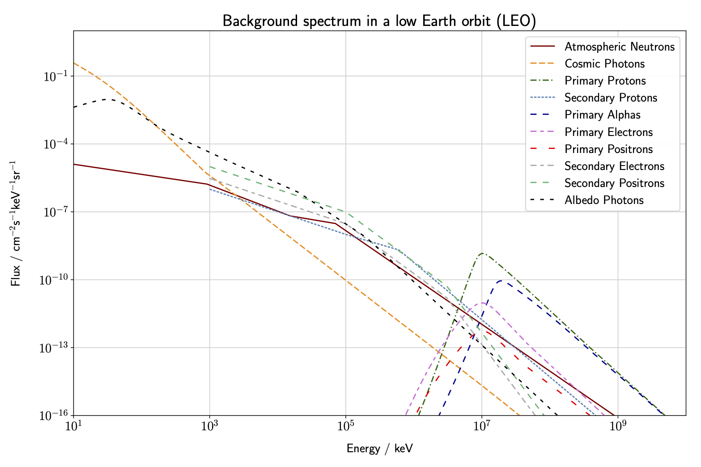

## Input Models

### Spectra and Source Files 
The input spectra are generated using the model from [Cumani](https://link.springer.com/article/10.1007/s10686-019-09624-0). This is implemented using the code **generate\_bcksource.py**, available in the **sg\_update** branch of the [cosi-background](https://github.com/cositools/cosi-background/tree/sg_update) repository. The source files used by cosima are also generated by this code. The user can choose the main parameters, including altitude, inclination, geomagnetic cut-off, etc. For DC2 we simulated an equatorial orbit at 550 km with a zenith pointing. Correspondingly, for the BGs we used the average rigidity cut-off for this orbit (10 GV). Solar modulation is accounted for using the force field approximation, for which we use 650 MV, representative of the average solar activity (the minimum being 550 MV and the maximum 1100 MV). The resulting spectra are shown below. All of the input files, as well as configuration files used for the DC2 simulations, can be found [here](https://github.com/cositools/cosi-data-challenges/tree/main/cosi_dc). 

