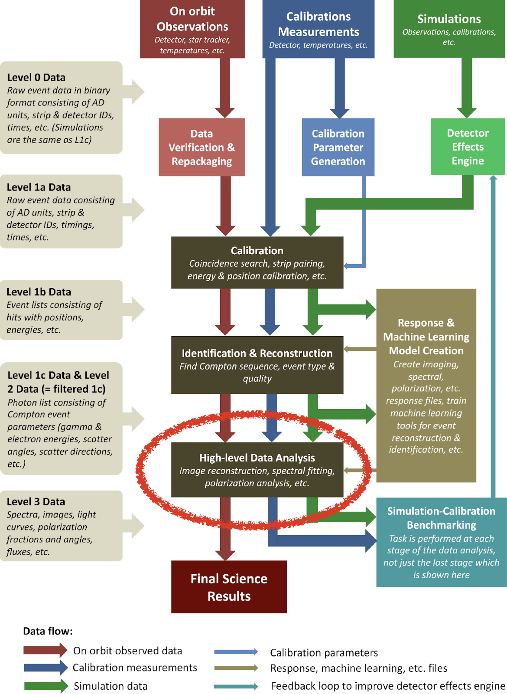
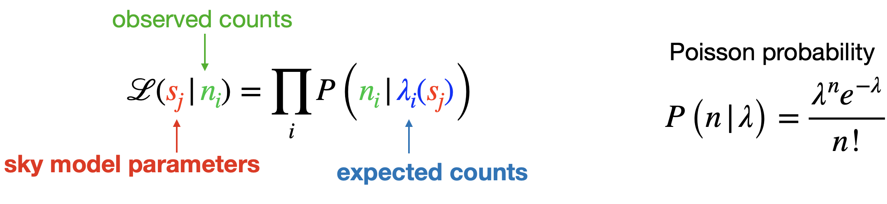
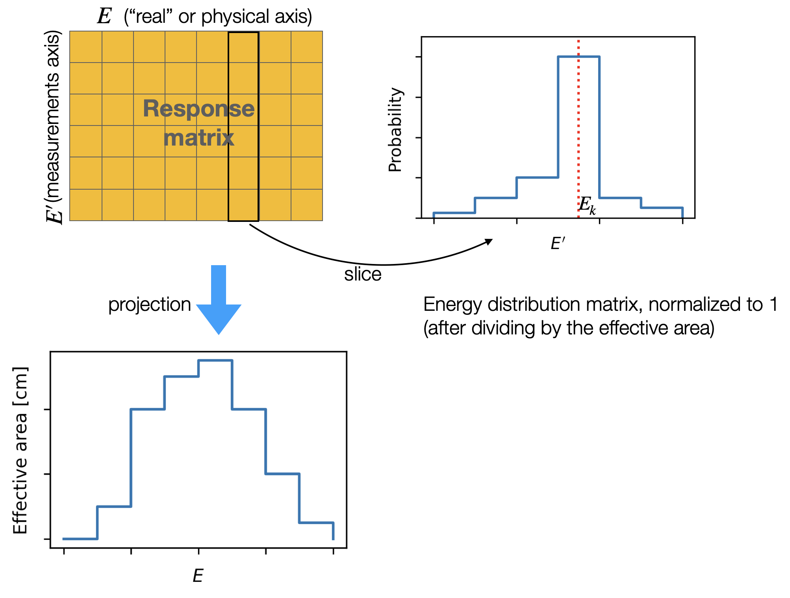
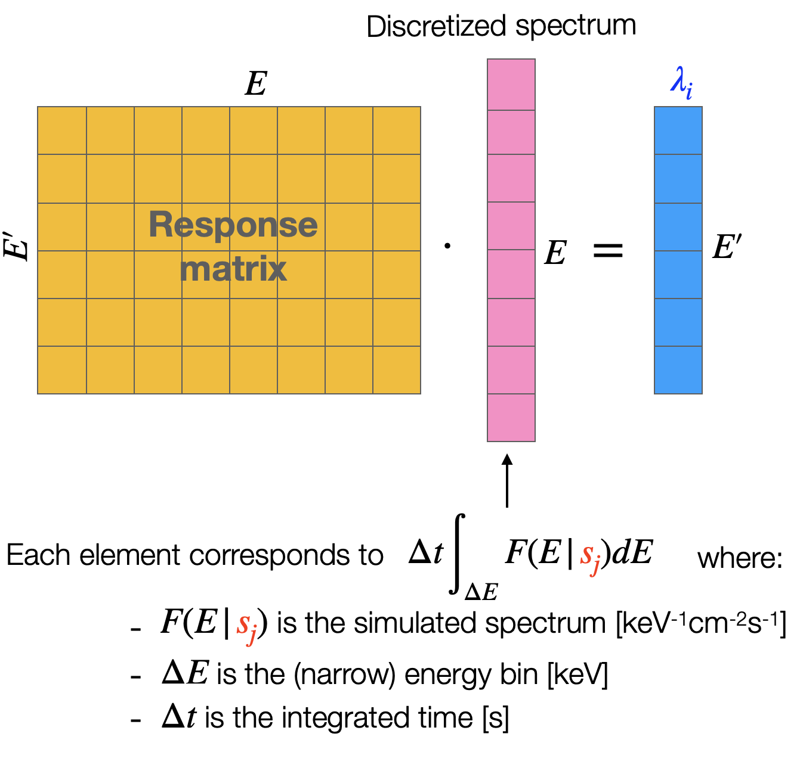
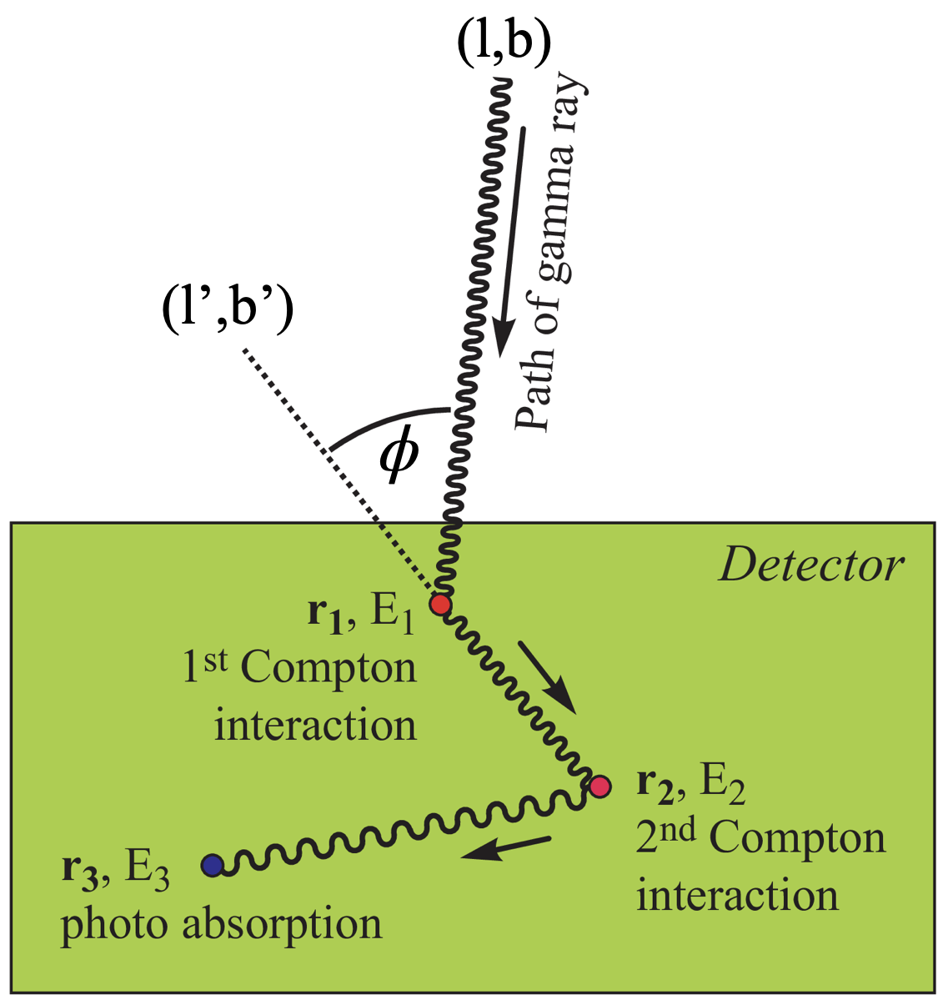
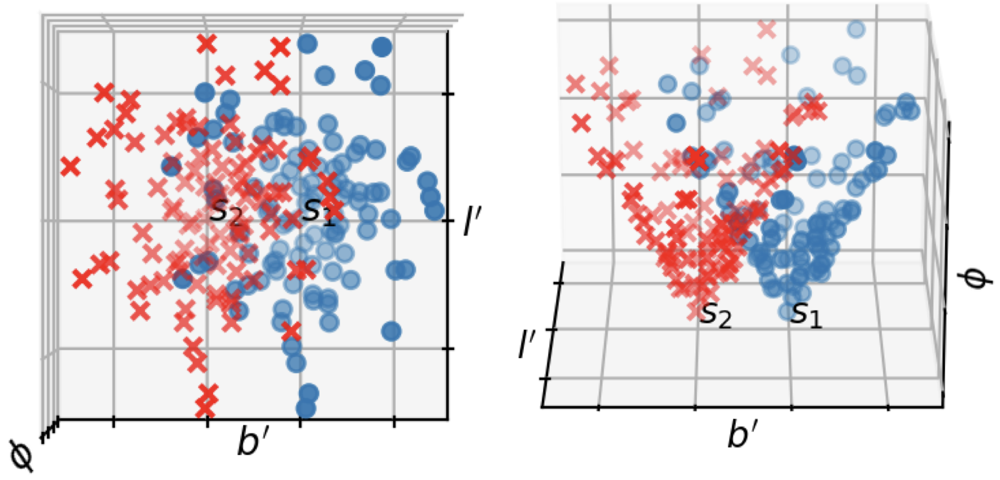
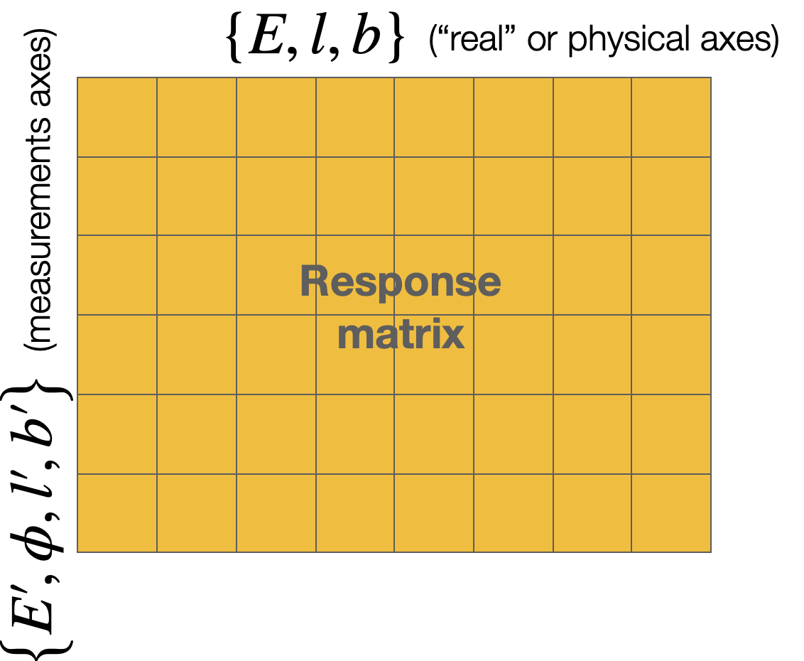
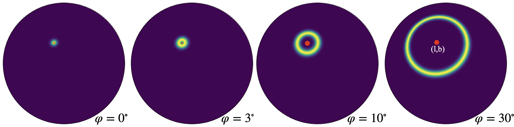
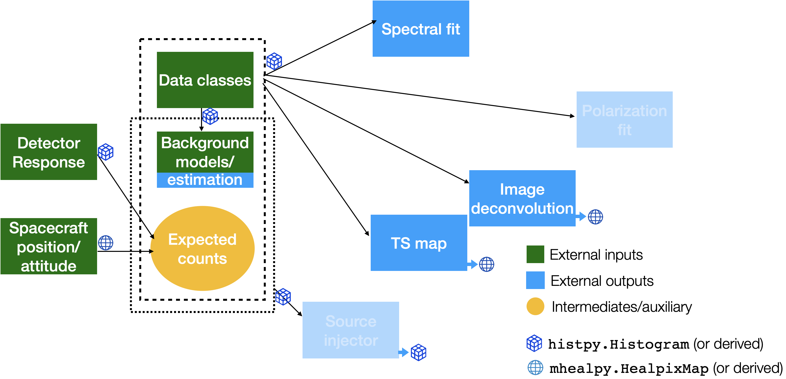

# Introduction to cosipy

The cosipy library is [COSI](https://cosi.ssl.berkeley.edu)'s high-level analysis software. It allows you to extract imaging and spectral information from the data, as well as to perform statistical model comparisons. The cosipy products are meant to be ready for interpretation.

The main repository is hosted at https://github.com/cositools/cosipy

Here we explain how cosipy works internally, including the statistical analysis. We also end with a note on the next steps for cosipy, in the context of the second COSI data challenge release.

For the cosipy installation and usage instructions please refer to the main [cosipy documentation](https://cositools.github.io/cosipy/).

## cosipy and cositools

COSItools is the collection of all COSI data-analysis tools, including raw data formatting, calibration, reconstructions, and simulations. The cosipy library is the final of all the steps in the pipeline, shown in the following diagram as the "High-level Data Analysis" block



The cosipy inputs are the calibrated and reconstructed data, the spacecraft orientation history, and MEGAlib's event-by-event simulations. Cosipy combines these data using statistical tools to infer physical information, such as spectra and images, and obtain model comparison statistics. These then need to be interpreted by the user.

The cosipy library is open-source and written in Python.

## The cosipy analysis

Cosipy uses a likelihood-based forward-folding technique. This means that different source hypotheses are convolved with the instrument response in order to obtain the expected data. The expectation is directly compared to the observed data to evaluate the likelihood that the source hypothesis explains the observations, and therefore find the best model. In the following section, we explain what we actually mean by all of this! 

### Likelihood analysis

Every analysis in cosipy is based on the following likelihood function:



A way to interpret it is that the likelihood of a given physical model given the observed data equals the probability of obtaining the particular observed data sample given the physical model.

In our case, the physical sky model is composed of all the source parameters considered by the user. For example, the flux of various sources, their spectral index, sky location, background level, etc. The parameters can also be flux values on each location of the discretized sphere, as is the case when we do imaging.

The observed data corresponds to the measured counts in each bin. In COSI we bin the data in measured energy, and the Compton Data Space (see [below](#anchor_CDS)). These are integer values, are are typically sparse ---i.e. most bins are empty.

The expected counts are the number of observed counts you would expect from simulation given a set of sky model parameters. This allows us to compare directly to the data, apples with apples. As opposed to the observed counts, these are not integers but floating point numbers, since they correspond to the _average_ number of counts you would observe. There is one such number per bin in the data space, and typically it is not sparse --i.e. you can expect something close to 0, but not exactly 0, unless the bin is actually unphysical. In the next [section](#anchor_rsp_intro) we will see how to obtain them.

The probability of observing a given number of counts based on the expectation is described by a Poisson distribution. In other words, we are assuming that the photons are totally independent of each other

Although there are multiple ways to use the likelihood to perform inference analysis, so far we have only performed maximum likelihood estimations (MLE). Our goal is to obtain the best estimates for the real values of the sky model parameters given the data, and those correspond to the parameters that maximize the likelihood --i.e. those that maximize the probability of obtaining our data sample. The corresponding equation is:


$$\mathcal{L}(\hat{\color{red}s_j }|{\color{PineGreen}n_i}) = \max \mathcal{L}({\color{red}s_j }|{\color{PineGreen}n_i})$$

<a name="anchor_rsp_intro"></a>
### The detector response: an introduction

In principle, for each set of sky model parameters, we could run the MEGAlib simulations and see how many events we obtain on average, which corresponds to the expected counts. This is not feasible since we need to run this multiple times while we sample the parameters space. Instead, we build a detector response matrix that encodes the information that we need. 

In order to understand the mechanics, let's forget for a moment about imaging and assume the only measured value is the energy. For this case, we simulate multiple photons at various _real_ energies ($E$) and record how many we detect in total ($N_{det}$), and how their _measured_ energies are distributed ($E'$). Since we know the events per unit area (flux) used in the simulations, we can compute the effective area as:

$$A_{eff} = \frac{N_{det}}{flux}$$

The effective area is a function of the energy, so we choose multiple values. The effective area of each sampled energy point, distributed based on the _measured_ energies observed in the simulations, is the detector response matrix:



The response matrix then related physical value -e.g. the real energy $E$- to measured quantities -e.g. number of counts in a measured energy $E'$ bin. This is achieved by discretizing the spectrum of a given source model and performing a matrix multiplication or "convolution":



Note that while now we can obtain the expected excess relatively quickly, we paid a penalty by discretizing the effective area and the spectrum. This introduces an error, which is why it is important to use narrow energy bins. On the other hand, a coarse _measured_ energy axis will not introduce an error, but it can severely degrade the sensitivity of the analysis. 

<a name="anchor_CDS"></a>
### The Compton Data Space

In addition to the measured energy, COSI can also obtain imaging and polarization information encoded in the Compton Data Space (CDS) (see diagram below):

- (l',b'): The direction of the scattered gamma after the first interaction. Typically in galactic coordinates.
- $\phi$: The polar scattering angle. Although we don't know the direction of the incoming gamma ray, we do know the scattering angle due to kinematics.



This is key to performing imaging since the photons from a source form a clearly identified cone in the CDS. This is what allows us to disentangle the different sources in our field of view at any given time! The following shows an example for two sources: if we only had (l',b'), we could not resolve the different sources:



### The detector response: full version

As we saw in the previous section, in order to do spectral *and* imaging we need to bin the data into both the measured energy and the full CDS (four dimensions). Respectively, the total expected counts and their distribution depend on the real photon energy and the source location (three dimensions). The full response is then a 7-dimensional matrix, composed of both physical and measured axes:



Although this might look more complicated, the mechanics are exactly the same as for the simplified spectral analysis with a 2D response that we saw in the [previous section](#anchor_rsp_intro). The expected number of counts is still a matrix multiplication. The projection onto the physical axes is still the effective area. A slice for a given combination of energy, measured energy, and direction (red dot) looks like this in the Compton Data Space: 



For simplicity, we have simply assumed that the spacecraft is fixed in an inertial reference frame –galactic coordinates, in this case. In reality, the spacecraft is always moving, and the response of the instrument –a function of the local spacecraft coordinates– needs to be convolved with the orientation history of the spacecraft. Alternatively, the data can be binned in time, with small enough bins such that the spacecraft can be considered static within the bin. Furthermore, we can collect multiple time bins where the spacecraft had the same orientation into "spacecraft attitude bins" –a.k.a. scatt bins. More details are explained [here](https://github.com/cositools/cosipy/tree/main/docs/tutorials/response/SpacecraftFile.ipynb).

## The cosipy modules, inputs and outputs

In cosipy, different modules are combined to perform the implementation of the likelihood computation described above.

- The DataIO module performs the binning of the data ($n_i$). 
- The Spacecraft File module keeps track of the spacecraft orientation, so we can transform galactic coordinates to detector coordinates.
- The Detector Response module reads the response matrix obtained from MEGAlib and produces the expected signal counts.

We add the expected background counts to obtain the total expectation. The normalization can be a free parameter of the model.

The likelihood is then maximized by other modules, which have different goals:

- Spectral fit: the sky model parameters are the source(s) spectral shape and normalization parameters. The source location can also be float, but the initial guess is nearby. 
- TS map: the sky model parameters are the source sky location. Is it designed to look for a source --e.g. a GRB-- in the whole sky.
- Image deconvolution: the sky model is discretized, effectively having one free parameter for every sky pixel and energy bin. The main advantage is that is it not model-dependent; the main disadvantage is that it is hard to estimate errors due to the high correlation between the different parameters.

Cosipy does not currently include polarization analysis, that will wait for the next data challenge.

Although cosipy doesn't have a source injector (simulator) yet, it is relatively easy to do given the expected counts. It would be a good exercise/challenge.

Internally, all modules handle the data using the objects:

- [histpy.Histogram](https://histpy.readthedocs.io/en/latest/): labeled axes in a matrix, support sparse matrices, perform projections and slice operations, etc.
- [mhealpy.HealpixMap](https://mhealpy.readthedocs.io/): sphere discretized using the [HEALPix](https://healpix.sourceforge.io/) standard.  



## Integration with 3ML and astromodels

The Multi-Mission Maximum Likelihood framework ([3ML](https://threeml.readthedocs.io/en/stable/)) is a common interface to perform a likelihood-based analysis across multiple instruments. Since all instruments observe the same source, their likelihoods for a common source model can be simply multiplied to obtain the global likelihood:

```math
\mathcal{L}_{}(\mathrm{model}) = \mathcal{L}_{\mathrm{NuSTAR}}(\mathrm{model}) \cdot \mathcal{L}_{\mathrm{GBM}}(\mathrm{model}) \cdot \mathcal{L}_{\mathrm{COSI}}(\mathrm{model}) \cdot \mathcal{L}_{\mathrm{LAT}}(\mathrm{model}) \cdot \mathcal{L}_{\mathrm{HAWC}}(\mathrm{model})\ldots
```

All 3ML needs is a plugin for each instrument that accepts a common model in a predetermined format ([astromodels](https://astromodels.readthedocs.io/en/latest/)), convolves it with its particular instrument response, and returns a likelihood. This is precisely what COSILike does.

Once you have a global likelihood function, the analysis machinery is the same whether you have one detector or multiple. This is why we reuse directly the 3ML algorithms to perform our spectral analysis!

## Differences with cosipy-classic

The first COSI data challenge release used the analysis software developed by Thomas Siegert, now called "cosipy-classic". While the analysis is very similar between cosipy and cosipy-classic, the new cosipy brings several improvements:

- Increase in sensitivity, since the analysis is always performed in $\left\lbrace E', \phi, l', b' \right\rbrace$, not projected into $\left\lbrace E' \right\rbrace$ (for the spectral analysis) and $\left\lbrace E', \phi, l', b' \right\rbrace$ (for imaging)
- 3ML integration
- The response and data are easier to visualize and manipulate, thanks to using:
    - mhealpy
    - histpy
    - Astropy coordinates and reference frame
- Easier to use, maintain and extend
    - Code is organized in modules and classes
    - More user-friendly API (work in progress)
    - Better documentation (work in progress)
    - Configurable (work in progress)

## Next steps

The cosipy library is under active development in preparation for the COSI launch scheduled in 2027. There are currently 50 open issues and/or desired features as of today!

The next steps for cosipy can be classified into three categories:

### Adding new features

While COSI will be capable of measuring polarization, polarization analysis was not included in Data Challenge 2. It will be part of Data Challenge 3.

Various improvements to the imaging algorithm are underway. The cosipy version at launch will contain various imaging algorithm approaches.

We are also developing a source injector starting from the detector response, as opposed to starting always from MEGAlib event-by-event simulations. This will simplify sensitivity calculations and theoretical predictions.

On Data Challenge 2 we assumed we knew the shape of the background distribution. While the background normalization is a free parameter, we use the same distribution of background counts --in measured energy and the Compton Data Space-- as the simulated data. For real data, although we can simulate the background, we will not know a priori exactly what the background distribution is, and therefore it needs to be estimated. We are working on background estimation techniques for the next release.

### Optimization and scalability

Currently, we have a coarse detector response and no polarization, and the code is still relatively slow. This will not be sustainable when we use a binning appropriate for COSI's capabilities. 

Some options are:

- Further code optimization. We haven't profiled the code exhaustively, it's likely that there are still low-hanging fruits.
- Decouple the response matrix from data binning. Although currently we explicitly do a direct matrix multiplication, we can _effectively_ perform this same operation in clever ways. We are exploring various ways to perform the response interpolation, including:

    - Using machine learning techniques
    - Exploiting the approximate symmetries
    - Reparametrizations of the response.
- We are developing an unbinned analysis, which might speed up some analyses --e.g. GRBs.

### Improving the code usability and maintenance

These tasks include:

- Improve parts of the documentation that might not be clear.
- Add unit tests until we have full coverage, and run these tests automatically with each pull request
- Standardize the API and coding style across all modules
- Develop yaml-configurable analysis scripts.


