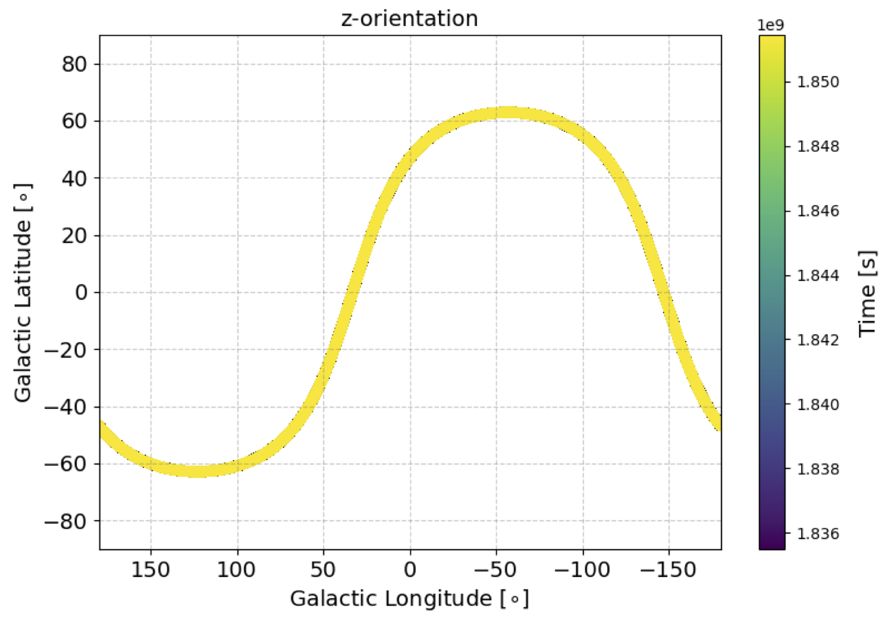
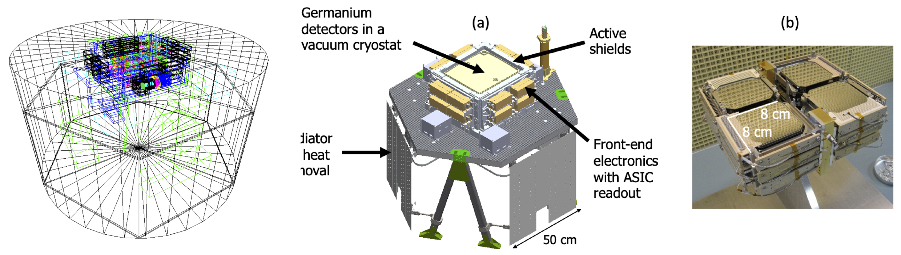
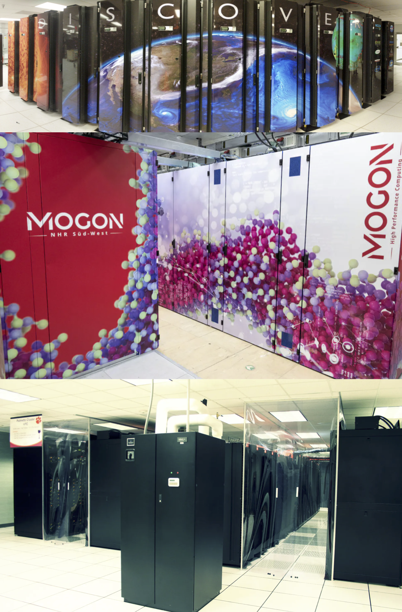

# Data Products

### Simulated Data

We simulated 3 months of exposure time for an equatorial orbit at 550 km with a zenith pointing. The simulations mimic the actual time-dependence of the instrument's pointing on the sky. The figure below shows the pointing of the instrument's z-axis as a function of time, in Galactic coordinates. 

The simulations employ [MEGAlib](https://github.com/zoglauer/megalib) (*main* and *feature/dee2022* branches) via the COSI simulation pipepline ([cosi-data-challenges](https://github.com/cositools/cosi-data-challenges)), using version 12 of the COSI-SMEX mass model. This is a simplified version of the mass model, and we are currently working on a more detailed one which will be implemented in future data challenges. The far left image below shows the mass model plotted with MEGAlib's *geomega*. Note that in addition to the payload, the satellite mass is also included, below the payload interface board. For comparison, we also show a schematic of the mass model (middle) and the prototype germanium detectors (right) from [Tomsick+23](https://ui.adsabs.harvard.edu/abs/2023arXiv230812362T/abstract).

More specifically, for the source simulations (with *cosima*) we use the *main* branch of MEGAlib, together with the COSISMEX.Geo.setup version of the mass model. This has a high strip pitch for charge sharing. For the event reconstruction (with *revan*) we use the *feature/dee2022* branch, together with the COSISMEX.O64.geo.setup version of the mass model. This implements the new detector effects engine (i.e. dee2022). We simulate energies between 100 keV - 10 MeV. Note that COSI's nominal energy range is 200 keV - 5 MeV. We used an upper bound of 10 MeV in order to account for energy dispersion. Earth occultation is accounted for in the simulations by blocking all photons with arrival directions beyond $\mathrm{113^\circ}$ of the zenith. We only select photons corresponding to Compton events. The full configuration files used for the event reconstruction (with *revan*) and extracting the data (with *mimrec*) can be found [here](https://github.com/cositools/cosi-data-challenges/tree/main/cosi_dc/Input_Files/Configuration_Files/Data_Challenges/Data_Challenge_2/DC2).

### Data Format
The data is provided in fits file format, which contains all of the photon information for each reconstructed event. If you are unfamiliar with analysis of Compton data, we highly recommend reading the [DC1](https://github.com/cositools/cosi-data-challenge-1) introduction page, which covers some of the fundamental topics. In short, the data for each reconstructed photon event is decribed in terms of four axes: energy, time, Compton scattering angle (&phi;), and event circle axis (&psi; &chi;). For Compton data, photons occupy what is known as the Compton data space, which is a 3-dimensional space defined by the axes &phi;, &psi;, and &chi;, where &psi; and &chi; are the angles defining the vector that points from the location of the second detector hit to the location of the first detector hit. A reconstructed photon event corresponds to a so-called event circle on the sky, where the axis of the circle is given by the &psi; &chi; vector, and the radius of the circle is given by the Compton scattering angle &phi;. For the actual data analysis, &psi; and &chi; are defined using a healpix grid, allowing us to reduce this to a single dimension (&psi; &chi;), i.e. the healpix pixel number.  

There are fits files for each individual component, for both sources and backgrounds. Each data challenge specifies the specific source files that you'll need. In order to create the dataset for a given data challenge, you will need to combine the source data with the background data. Instructions on how to do this are provided in the [DataIO example](https://github.com/cositools/cosipy/tree/main/docs/tutorials/DataIO) in cosipy, as well as some of the DC2 example jupyter notebooks. There are 12 individual background components that need to be combined in order to obtain the total background. Alternatively, a file with the total background already combined is also available. 

**Important Note:** Combining the data and binning the data can be memory intensive. If you are running into memory limitations at these steps, then workarounds are described in the dataIO example. Alternatively, we have also provided binned data products for some of the larger files (total background, 511, and Al26), which can be loaded directly. For each respective binned file, the binning matches the response, and has a time bin size of 7202.125 seconds.  

### Computing Resources 

The source simulations were ran on NASA's [Discover cluster](https://www.nccs.nasa.gov/systems/discover). We used 1000 parallel CPUs for most of the source simulations, which allowed us to simulate them in a fairly short time (typically less than ~10 minutes of total wall time per source). The source models were provided by the COSI science teams, and more information about them can be found in the respective **Data Challenges** section on the main page. The Background simulations were ran on the [MOGON](https://mogonwiki.zdv.uni-mainz.de/docs/introduction/what_is_mogon) cluster in Mainz and Clemson University's [Palmetto](https://docs.rcd.clemson.edu/palmetto/) cluster. Simulations of the backgrounds were highly computationally intensive. The most time-consuming simulations were the primary protons, which required 57.5 years of CPU time! This was accomplished by using 6045 parallel cores. More details about the background simulations can be found in the [backgrounds](https://github.com/cositools/cosi-data-challenge-2/tree/main/backgrounds) directory.

### Accessing the Data

The data is hosted on [wasabi](https://console.wasabisys.com/file_manager/cosi-pipeline-public?region=us-west-1), and it can be downloaded using the command line prompt below:
<pre>
AWS_ACCESS_KEY_ID=GBAL6XATQZNRV3GFH9Y4 AWS_SECRET_ACCESS_KEY=GToOczY5hGX3sketNO2fUwiq4DJoewzIgvTCHoOv aws s3api get-object  --bucket cosi-pipeline-public --key full/path/your_file --endpoint-url=https://s3.us-west-1.wasabisys.com your_file
</pre>
Note that you must replace 'full/path/your_file' (after '--key') and 'your_file' (at the end) with the actual path and file. All the needed paths and file names are given below. The specific files needed for each respective data challenge are given in the **Data Challenges** section on the main page.

Alternatively, cosipy has a utility function that can be used for downloading files. The usage is as follows:
<pre>
from cosipy.util import fetch_wasabi_file
  
fetch_wasabi_file('full/path/wasabi/file')
</pre>
Note that an error will be thrown if the file already exists. To overwrite the existing file, the keyword ``override=True`` can be passed.   

**Orientation File:**  
wasabi path and file: COSI-SMEX/DC2/Data/Orientation/20280301_3_month.ori  

**Response Files:**  
wasabi path: COSI-SMEX/DC2/Responses  

Detector Response Files:  
SMEXv12.511keV.HEALPixO4.binnedimaging.imagingresponse.nonsparse_nside16.area.h5  
SMEXv12.1809keV.HEALPixO4.binnedimaging.imagingresponse.nonsparse_nside16.area.h5  
SMEXv12.44Ti.HEALPix04.E_1150_1164keV.binnedimaging.imagingresponse.nonsparse_nside16.area.h5  
SMEXv12.Continuum.HEALPixO3_10bins_log_flat.binnedimaging.imagingresponse.nonsparse_nside8.area.good_chunks_unzip.h5.zip  

Point Source Response Files (in Responses/PointSourceReponse):  
psr_gal_511_DC2.h5.gz  
psr_gal_Al26_DC2.h5.gz  
psr_gal_Ti44_E_1143_1171keV_DC2.h5.gz  
psr_gal_Ti44_E_1150_1164keV_DC2.h5.gz  
psr_gal_continuum_DC2.h5.zip  

**Background Files:**  

wasabi path: COSI-SMEX/DC2/Data/Backgrounds  

Unbinned Files:  
total_bg_3months_unbinned_data.fits.gz  
cosmic_photons_3months_unbinned_data.fits.gz  
albedo_photons_3months_unbinned_data.fits.gz  
primary_protons_prompt_3months_unbinned_data.fits.gz  
primary_protons_decay_3months_unbinned_data.fits.gz  
primary_alphas_prompt_3months_unbinned_data.fits.gz  
primary_alpha_delayed_3months_unbinned_data.fits.gz  
primary_electrons_3months_unbinned_data.fits.gz  
primary_positrons_3months_unbinned_data.fits.gz  
NeutronAtm_prompt_3months_unbinned_data.fits.gz  
NeutronAtm_decay_3months_unbinned_data.fits.gz  
secondary_protons_prompt_3months_unbinned_data.fits.gz  
secondary_protons_delayed_3months_unbinned_data.fits.gz  

Binned Files:  
total_bg_3months_binned_for_511.hdf5  
total_bg_3months_binned_for_Al26.hdf5  
total_bg_3months_binned_for_Ti44_E_1143_1171keV.hdf5  
total_bg_3months_binned_for_Ti44_E_1150_1164keV.hdf5  
total_bg_3months_binned_for_continuum.hdf5  

**Source Files:**  

wasabi path: COSI-SMEX/DC2/Data/Sources  

Sources:  
For DC2 we simulated 30 unique sources, running 49 different simulations in total (using multiple models for some of the sources). 

Unbinned Files:  
GRB101216721_unbinned_data.fits.gz  
GRB081122614_unbinned_data.fits.gz  
GRB090206620_unbinned_data.fits.gz  
GRB090227772_unbinned_data.fits.gz  
GRB090228204_unbinned_data.fits.gz  
GRB130425327_unbinned_data.fits.gz  
GRB080723557_unbinned_data.fits.gz  
GRB080725541_unbinned_data.fits.gz  
GRB081101491_unbinned_data.fits.gz  
GRB081223419_unbinned_data.fits.gz  
GRB180128215_unbinned_data.fits.gz  
GRB200415A_unbinned_data.fits.gz  
511_thin_diskx10_3months_unbinned_data.fits.gz  
511_thin_disk_3months_unbinned_data.fits.gz  
511_thick_disk10x_3months_unbinned_data.fits.gz  
511_thick_disk_3months_unbinned_data.fits.gz  
511_Testing_3months_unbinned_data.fits.gz  
Al26_R5000_z1000_M60_3months_10xflux_unbinned_data.fits.gz  
Al26_R5000_z1000_M60_3months_unbinned_data.fits.gz  
Al26_R5000_z0200_M30_10xflux_3months_unbinned_data.fits.gz  
Al26_R5000_z0200_M30_3months_unbinned_data.fits.gz  
Ti44_SNsurprise_x50_3months_unbinned_data.fits.gz  
Ti44_SN1987A_x50_3months_unbinned_data.fits.gz  
Ti44_SNsurprise_3months_unbinned_data.fits.gz  
Ti44_SN1987A_3months_unbinned_data.fits.gz  
Ti44_G1903_3months_unbinned_data.fits.gz  
Ti44_G1903_x10_3months_unbinned_data.fits.gz  
Ti44_CasA_x50_3months_unbinned_data.fits.gz  
Ti44_CasA_3months_unbinned_data.fits.gz  
cygX3_FSXR_54percent-transition_46percent_3months_unbinned_data.fits.gz  
cygX3_transition_3months_unbinned_data.fits.gz  
cygX3_FSXR_3months_unbinned_data.fits.gz  
cygX1_hard-soft_3months_unbinned_data.fits.gz  
cygX1_soft_3months_unbinned_data.fits.gz  
cygX1_hard_3months_unbinned_data.fits.gz  
crab_3months_unbinned_data.fits.gz  
Crab_DC2_3months_unbinned_data.fits.gz  
crab_no_Earth_occultation_3months_unbinned_data.fits.gz  
PSRJ1846_3months_unbinned_data.fits.gz  
PSRB1509_3months_unbinned_data.fits.gz  
GRS1758_3months_unbinned_data.fits.gz  
1E1740_two_components_3months_unbinned_data.fits.gz  
1E1740_compton-powerlaw_3months_unbinned_data.fits.gz  
3C279_low100_3months_unbinned_data.fits.gz  
3C279_high100_3months_unbinned_data.fits.gz  
4C21p35_3months_unbinned_data.fits.gz  
3C273_10xFlux_3months_unbinned_data.fits.gz  
3C273_3months_unbinned_data.fits.gz  
cenA_3months_unbinned_data.fits.gz  

Binned Files:  
511_thin_diskx10_3months_binned_data.hdf5  
511_thin_disk_3months_binned_data.hdf5  
511_thick_disk10x_3months_binned_data.hdf5  
511_thick_disk_3months_binned_data.hdf5  
511_Testing_3months_binned_data.hdf5  
Al26_R5000_z1000_M60_3months_10xflux_binned_data.hdf5  
Al26_R5000_z1000_M60_3months_binned_data.hdf5  
Al26_R5000_z0200_M30_10xflux_3months_binned_data.hdf5  
Al26_R5000_z0200_M30_3months_binned_data.hdf5  
